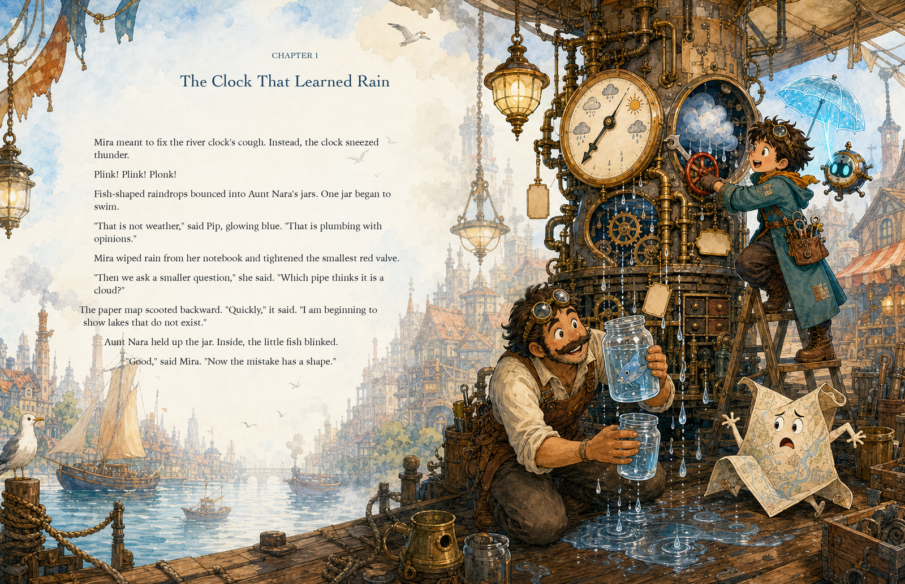
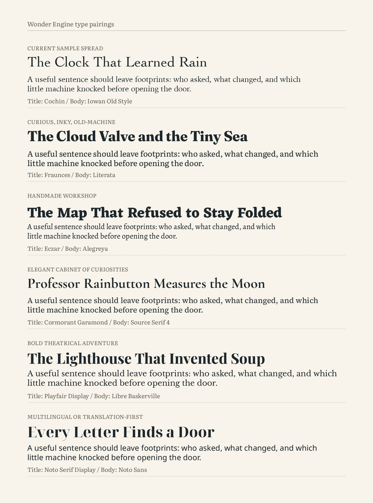

# Wonder Engine

**Serious ideas, turned into story-worlds you can wander through.**

Wonder Engine turns papers, research directions, school topics, technical trends, and private fascinations into strange, clever illustrated books. It treats an idea not as a lesson to summarize, but as a world to build: concepts become machines, creatures, maps, rituals, rules, weather, jokes, and trouble.

The process begins with a creative interview, then moves through source digestion, story architecture, continuity anchors, one-spread-at-a-time image generation, careful text layout, and a polished PDF. The aim is a book with real narrative gravity: odd and science-flavored, visually dense but readable, playful enough for children and layered enough for adults.

<figure>
  
  <figcaption><em>Example spread generated by GPT Image 2.0; final story text was typeset and proofed separately for the PDF.</em></figcaption>
</figure>

## What It Makes

A finished Wonder Engine book can include:

- portrait front cover
- opening character-introduction spread with portraits, avatars, prop cards, or cast vignettes that anchor character continuity
- opening world-introduction spread with a map, object atlas, concept diagram, or machine/civic system that anchors world logic
- 20 double-page story spreads by default
- optional back matter explaining the real idea under the adventure
- optional portrait back cover with a short blurb, source note, or production credit
- final PDF with manually typeset story text and audited native labels where useful

The result should feel like an adventure, not a textbook or a captioned storyboard: characters argue, test, misunderstand, repair, escape, and discover. Abstract ideas become visible things: machines, maps, rituals, creatures, tools, diagrams, hazards, and rules.

## How It Works

1. **Interview**  
   A natural creative interview that uses nudges, contrasts, and occasional options to help the human discover what they mean: source material, audience, feeling, story mode, world flavor, culture/language, cast ecology, motifs, avoidances, length, and output.

2. **Digest the Source**  
   The workflow extracts the real thesis, mechanisms, vocabulary, stakes, and limits, then maps them into story objects and visual metaphors.

3. **Pitch the Book**  
   Imaginative title/tagline packages, lead/cast options, world, core metaphor table, chapter structure, and assumptions.

4. **Optional Visual Probe**  
   One disposable concept image can test the world, cast ecology, machinery/nature balance, density, and mood before the full story is planned. The probe is for feedback, not canon.

5. **Continuity Bible**  
   The workflow locks character anchors, world rules, recurring objects, map logic, visual motifs, and reusable prompt snippets before main story images are generated.

6. **Plan the Spreads**  
   A coherent chapter-by-chapter beat plan where every spread has a visible event, dialogue or reaction, enough story text to read aloud, and a reason to exist.

7. **Write and Prompt**  
   Final spread text, image prompt, composition notes, text-space plan, speech bubble notes, and print safety notes.

8. **Generate and Assemble**  
   Images are generated one by one, using the continuity bible and approved intro spreads as anchors. Final body text, titles, labels, and cover credits are typeset separately into the artwork for a clean PDF.

At every stage, Wonder Engine should also guide the human toward the next useful decision or review: what was just produced, what comes next, and what kind of feedback will move the book forward.

## Image Generation

Wonder Engine is image-generator agnostic.

Use the native image generation available in the current environment, keeping the same spread prompts, one-image-at-a-time review loop, and PDF assembly rules.

If more than one image model or image-generation tool is available, ask the human which one they want before the first visual probe or production spread. Wonder Engine is model-agnostic, but its current prompt guidance, native-label policy, and layout-proof workflow have been tested on GPT Image 2.0, so GPT Image 2.0 is the recommended default unless the human chooses another model.

The character-introduction and world-introduction spreads are special: they can use native image text for short integrated labels, names, badges, map marks, arrows, and tiny callouts. Labels should be reader-helpful: characters get a tiny who-they-are note, and fictional world elements get a brief what-it-does note when the name is not obvious. The workflow creates a locked label sheet first, then audits the generated image before approval. Story body text, cover credits, and long explanations are still typeset separately by default.

## The Layout Idea

Wonder Engine does not simply paste text over a white rectangle.

It plans native quiet space inside the illustration: mist, sky, water, paper, wall, snow, empty table, map margin, or another calm area that belongs to the scene. Then it fits the text to that space.

The current PDF helper includes a negative-space fitting pass:

```bash
python3 wonder-engine/scripts/new_manifest.py \
  --title "Working Title" \
  --subtitle "A Quirky Tagline" \
  --author "by Author Name" \
  --spreads 20 \
  --back-cover \
  --output build/book-manifest.json

python3 wonder-engine/scripts/fit_text_to_negative_space.py \
  build/book-manifest.json \
  --output build/book-manifest-fitted.json

python3 wonder-engine/scripts/assemble_picture_book_pdf.py \
  build/book-manifest-fitted.json \
  --output build/book-layout-proof.pdf \
  --preview-dir build/previews
```

The fitter measures pale, low-detail areas in the actual generated art and writes shaped text rows into the manifest. It is a proofing tool, not a substitute for taste: if a spread still feels awkward, revise the prose, regenerate the art, split the text, or move the title/body composition.

The first assembled PDF is a layout proof, not the finished book. Wonder Engine renders page previews, checks the actual usable quiet space in each image, adjusts text boxes and line shapes, and only calls the PDF final after every page looks intentionally typeset.

Chapter-start spreads get extra layout scrutiny: the chapter label, chapter title, and body text are treated as one stacked composition so the title does not float away from the text area or collide with the body copy.

## Typography

Wonder Engine asks about typography during the interview for full PDFs. The rule is simple: use a real pairing, not one generic fallback font. Large titles and body text should usually be different fonts with clear roles.

Good pairings for this kind of book:



| Mood | Title Font | Body Font | Why It Works |
| --- | --- | --- | --- |
| Current sample spread | **Cochin** | **Iowan Old Style** | The pairing used in the current proof spread: elegant, bookish titles with a warm readable old-style body. |
| Curious, inky, old-machine | **Fraunces** | **Literata** | Fraunces gives titles a playful old-style weirdness; Literata is built for sustained reading and keeps the page calm. |
| Handmade workshop | **Eczar** | **Alegreya** | Eczar feels sturdy, hand-cut, and storybook-strange; Alegreya keeps the reading warm and literary. Good for tools, markets, diagrams, and comic engineering. |
| Elegant cabinet of curiosities | **Cormorant Garamond** | **Source Serif 4** | Cormorant is ornamental and dramatic at large sizes; Source Serif 4 gives the manuscript steadier rhythm. |
| Bold theatrical adventure | **Playfair Display** | **Libre Baskerville** | Strong, high-contrast titles with a familiar, readable bookish body. Best when the art has a little drama. |
| Multilingual or translation-first | **Noto Serif Display** | **Noto Sans** | A practical starting point when language coverage matters more than decorative personality. Swap in script-specific Noto families as needed. |

These are examples, not limits. Choose other pairings when the language, culture, trim size, or book personality calls for it.

## Illustration Direction

The current skill focuses on whimsical, dense, science-flavored adventure illustration: rich scenes, careful machinery, visible systems, expressive main characters, clean negative space, and simplified background figures.

More illustration style presets are planned for the future. The goal is to support different visual traditions, cultures, languages, moods, and production needs without copying any existing book, artist, character, or protected style.

## What Is Codified Today

- front cover generation and manual cover typography
- distinctive title plus subtitle/tagline guidance
- opening character-introduction spread as a character continuity anchor
- opening world-introduction spread as a world-logic anchor
- continuity bible for characters, world rules, map logic, recurring objects, and prompt snippets
- native-text label policy for character/world anchor spreads, with locked label sheets and proofreading
- optional back matter
- optional back cover
- one-spread-at-a-time image generation and approval
- show-don't-tell manuscript rules
- story-density guidance so spreads become full scenes, not two-sentence captions
- source-to-story metaphor mapping
- culture and language intake
- typography intake and font pairing guidance
- negative-space-aware PDF assembly
- page-by-page layout proofing before final PDF export
- chapter-start title/body collision checks
- forward-guidance behavior after each major stage
- exact text typesetting over approved images

## Files

- `wonder-engine/SKILL.md` - core skill instructions
- `wonder-engine/references/interview-options.md` - option-led interview prompts
- `wonder-engine/references/source-processing.md` - source digestion and metaphor mapping
- `wonder-engine/references/continuity.md` - character/world continuity bible and anchor-spread rules
- `wonder-engine/references/story-standards.md` - story, image, typography, and PDF quality rules
- `wonder-engine/scripts/new_manifest.py` - starter PDF manifest
- `wonder-engine/scripts/fit_text_to_negative_space.py` - text-shape fitting helper
- `wonder-engine/scripts/assemble_picture_book_pdf.py` - PDF proof/final assembly helper

## References Used for Typography

- Current proof spread fonts: Cochin for title/chapter text and Iowan Old Style for body text.
- [Google Fonts: Fraunces](https://fonts.google.com/specimen/Fraunces), [Literata](https://fonts.google.com/specimen/Literata), [Eczar](https://fonts.google.com/specimen/Eczar), [Alegreya](https://fonts.google.com/specimen/Alegreya), [Cormorant Garamond](https://fonts.google.com/specimen/Cormorant+Garamond), [Source Serif 4](https://fonts.google.com/specimen/Source+Serif+4), [Playfair Display](https://fonts.google.com/specimen/Playfair+Display), and [Libre Baskerville](https://fonts.google.com/specimen/Libre+Baskerville)
- [Noto documentation](https://notofonts.github.io/noto-docs/website/use/) for multilingual font coverage and licensing notes
- [Typewolf on headline/body Google Font pairings](https://www.typewolf.com/blog/google-fonts-combinations) for the principle of pairing a large-display face with a body face built for reading
